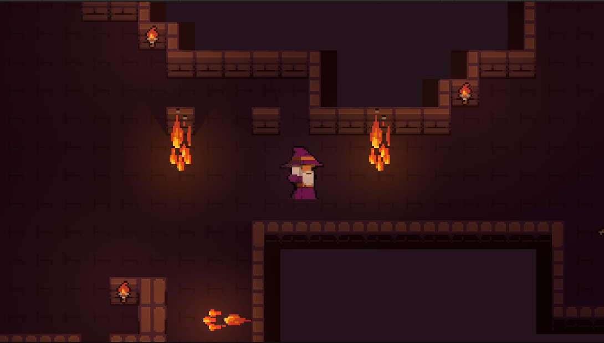
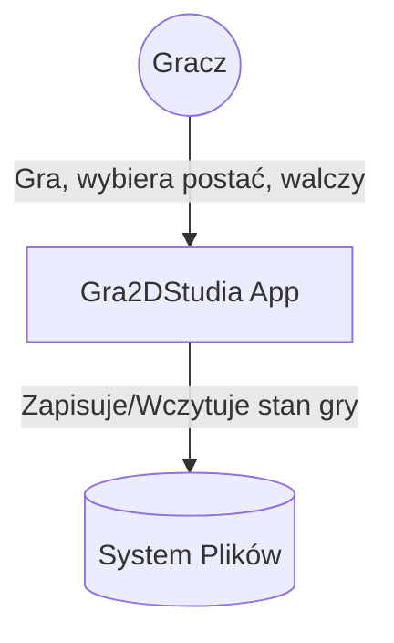
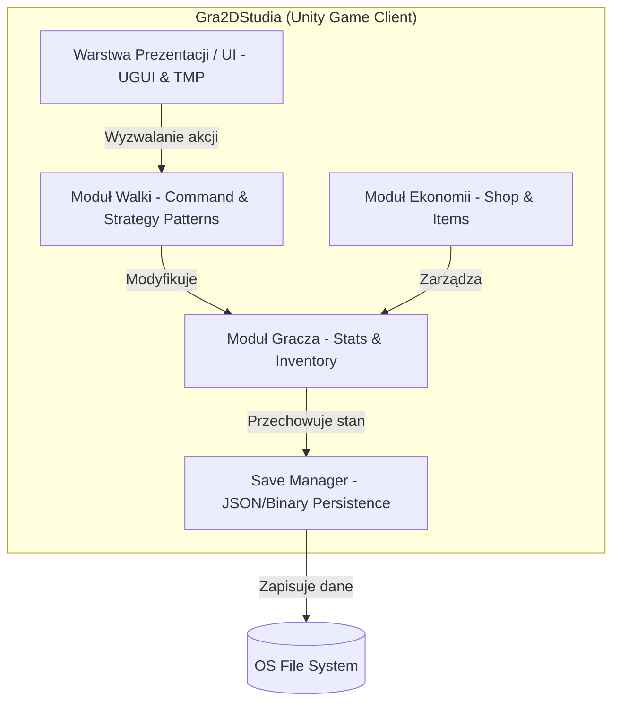

# Gra2DStudia


## Opis

Gra2DStudia to klasyczna gra RPG w formacie 2D, stworzona w silniku Unity 6. Projekt koncentruje się na turowym systemie walki, zaawansowanej progresji postaci oraz modularnym systemie ekwipunku, oferując solidne fundamenty pod rozbudowaną przygodę fabularną.

## Screenshot / Demo




## Stos technologiczny

- **Silnik**: Unity 6 (Wersja 6000.3.10f1)
- **Renderowanie**: Universal Render Pipeline (URP) dla 2D
- **Język**: C# (.NET 8.0+)
- **System wejścia**: Unity New Input System (v1.18.0)
- **Główne pakiety**:
  - **Cinemachine (v3.1.6)**: Inteligentne zarządzanie kamerą.
  - **TextMesh Pro (v2.0.0)**: Zaawansowane renderowanie tekstów.
  - **2D Animation (v13.0.4)**: Animacja szkieletowa postaci.
  - **Aseprite Importer (v3.0.1)**: Bezpośredni import grafik z Aseprite.

## Wymagania wstępne

Aby uruchomić projekt lokalnie, wymagane są:
- **Unity Hub** (do zarządzania wersjami edytora).
- **Unity 6000.3.10f1** lub nowsza kompatybilna wersja Unity 6.
- **Git** (do klonowania repozytorium).
- **IDE**: Visual Studio 2022 lub JetBrains Rider (zalecane).

## Instrukcja uruchomienia

### 1. Klonowanie repozytorium
```bash
git clone https://github.com/[WSTAW_TUTAJ]/Gra2DStudia.git
cd Gra2DStudia
```

### 2. Instalacja zależności
Otwórz **Unity Hub**, kliknij **Add** -> **Add project from disk** i wybierz folder projektu. Silnik automatycznie pobierze wymagane pakiety z `manifest.json`.

### 3. Konfiguracja
Projekt nie wymaga zewnętrznych zmiennych środowiskowych. Wszystkie kluczowe dane znajdują się w:
- `Assets/Data/`: ScriptableObjects z danymi przedmiotów i statystykami.
- `Assets/Settings/`: Konfiguracja renderowania URP.

### 4. Uruchomienie
1. W oknie **Project** przejdź do `Assets/Scenes/MenuGlowne.unity`.
2. Kliknij przycisk **Play** w edytorze Unity.

## Konfiguracja

| Zmienna / Zasób | Opis | Lokalizacja |
| :--- | :--- | :--- |
| `ItemDatabase` | Baza danych wszystkich przedmiotów w grze. | `Assets/Data/ItemDatabase.asset` |
| `PlayerClasses` | Definicje klas postaci (Warrior, Mage itp.). | `Assets/Data/PlayerClasses/` |
| `SavePath` | Lokalizacja plików zapisu (zależy od systemu). | `Application.persistentDataPath` |

## Architektura (Model C4)

Aplikacja została zaprojektowana w oparciu o wzorzec zbliżony do **MVC** , z silnym naciskiem na rozdzielenie systemów za pomocą interfejsów oraz zdarzeń  języka C#. Logika walki wykorzystuje wzorce projektowe **Strategy** oraz **Command**.

### Level 1: System Context

* **Gracz:** Użytkownik wchodzący w interakcję z aplikacją — wybiera postać, steruje rozgrywką oraz bierze udział w walkach.
* **Gra2DStudia App:** Główny system (rdzeń aplikacji), który przetwarza komendy gracza i zarządza wszystkimi podsystemami gry.
* **System Plików:** Zewnętrzny magazyn danych (dysk urządzenia), do którego aplikacja zapisuje oraz z którego wczytuje stan rozgrywki.

### Level 2: Container

*   **Warstwa Prezentacji / UI (UGUI & TMP):** Odpowiada za renderowanie interfejsu i tekstów. Przechwytuje akcje użytkownika i przekazuje je w formie zdarzeń do logiki biznesowej.
*   **Moduł Walki (Combat Module):** Obsługuje potyczki w grze przy użyciu wzorców **Strategy** (dynamiczna zmiana zachowań) oraz **Command** (kolejkowanie akcji). Po walce aktualizuje dane w Module Gracza.
*   **Moduł Ekonomii (Economy Module):** Zarządza logiką sklepu (`Shop`) oraz przedmiotami (`Items`). Nadzoruje transakcje i modyfikuje zasoby bohatera.
*   **Moduł Gracza (Player Module):** Centralny magazyn danych (Model) przechowujący statystyki postaci (`Stats`) oraz jej ekwipunek (`Inventory`). Współpracuje z modułem walki i ekonomii.
*   **Save Manager:** Odpowiada za trwałość danych. Pobiera stan z Modułu Gracza, serializuje go do formatu JSON lub binarnego i zapisuje bezpośrednio w systemie plików (`OS File System`).

## Struktura projektu

```text
C:\Users\Kacper\Documents\GitHub\Gra2DStudia\
├── Assets/
│   ├── Art/                # Sprity, animacje, audio
│   ├── Data/               # ScriptableObjects (bazy danych, loot tabele)
│   ├── EDITOR/             # Narzędzia edytorskie (Dungeon Generator)
│   ├── Prefabs/            # Prefaby UI i encji
│   ├── Scenes/             # Sceny gry (Menu, Combat, Camp)
│   └── Scripts/            # Kod źródłowy C#
│       ├── Combat/         # Logika walki (Commands, Strategies)
│       ├── Player/         # Model gracza i statystyki
│       ├── Economy/        # Sklep i przedmioty
│       ├── Menu/           # Kontrolery UI
│       └── Tests/          # Testy jednostkowe i integracyjne
├── Packages/               # Pakiety Unity
└── ProjectSettings/        # Konfiguracja projektu Unity
```

## Interfejsy systemu

### Mechaniki i Sterowanie
| Akcja | Klawiatura/Mysz | |
| :--- | :--- | :--- |
| **Poruszanie** | `WASD`| 
| **Atak** | `LMB` |
| **Interakcja** | `E` |
| **UI Navigate** | `Mysz` |
| **Ekwipunek** | `I` |
| **Questy** | `J` |
| **Menu** | `ESC` |

## Testy

Projekt zawiera zestaw testów automatycznych uruchamianych przez **Unity Test Runner**.
- **Logika walki**: Testy znajdują się w `Assets/Scripts/Tests/`.
- **Debugging**: Skrypt `CombatConsoleTester.cs` umożliwia testowanie mechanik walki bez konieczności interakcji z UI.

Aby uruchomić testy:
1. W Unity przejdź do `Window` -> `General` -> `Test Runner`.
2. Kliknij **Run All** (w zakładce EditMode lub PlayMode).

## Zespół

| Imię i Nazwisko | Rola | Odpowiedzialność |
| :--- | :--- | :--- |
| Kacper Rosiak | Team Leader | Zarządzanie projektem |
| Damian Wałęsa | Programmer | Moduł Walki & Core |
| Kacper Chróścik | UI Designer | Interfejs użytkownika |
| Adam Rokicki | QA Engineer | Testy |
| Mikołaj Skotak | QA Engineer | Bugfixing |

## Licencja

Projekt dystrybuowany na licencji **Apache 2.0**. Zobacz plik `LICENSE` po więcej szczegółów.
